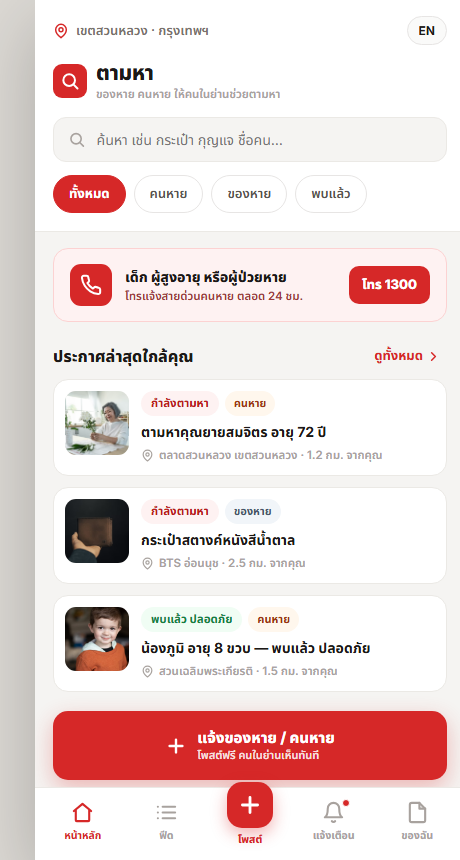
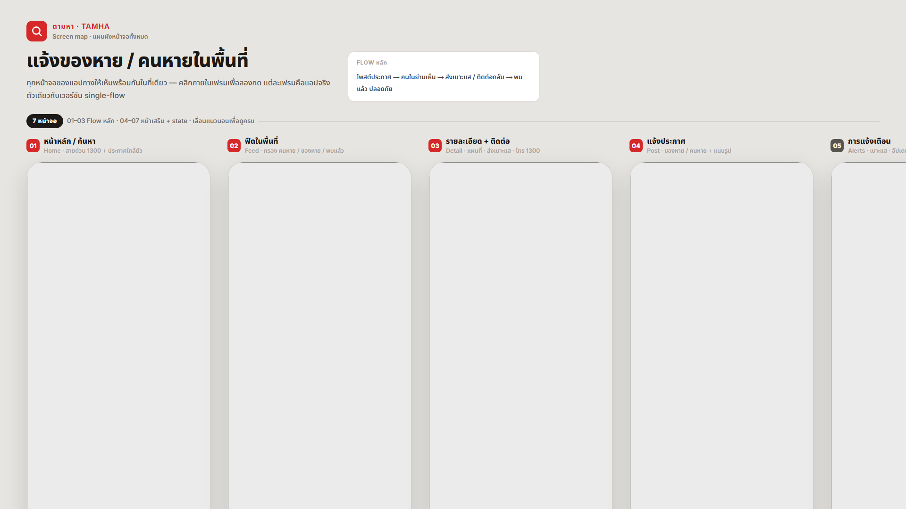

# Tamha

Tamha คือโปรโตไทป์ Design Component สำหรับแจ้งของหายและคนหายในพื้นที่ เน้นหน้าจอมือถือ ผู้ใช้สามารถร่างประกาศ แนบสถานะรูปแบบจำลอง ดูโพสต์ตัวอย่างใกล้ตัว เปิดหน้ารายละเอียด ส่งเบาะแส โทรหาผู้ติดต่อ และทำเครื่องหมายว่าพบแล้วได้

ชื่อไทยหมายถึง "ตามหา" ส่วน idea key ภายในคือ `แจ้งของหาย/คนหายในพื้นที่`

## หมายเหตุด้านความปลอดภัย

นี่เป็นโปรโตไทป์ ไม่ใช่ระบบฉุกเฉินจริง และไม่ใช่ระบบทางการสำหรับติดตามคนหาย ข้อมูลตัวอย่าง ระยะทาง แผนที่ การแจ้งเตือน geolocation และ backend เป็นการจำลองทั้งหมด หากเกิดเหตุเด็ก ผู้สูงอายุ ผู้ป่วย หรือบุคคลอื่นหายจริง ควรติดต่อเจ้าหน้าที่ที่เกี่ยวข้อง และใช้สายด่วนคนหาย 1300 ตามความเหมาะสม ห้ามเผยแพร่ข้อมูลส่วนตัวหรือข้อมูลอ่อนไหวโดยไม่มีเหตุที่ถูกต้องและไม่ได้รับความยินยอมตามที่กฎหมายกำหนด

## สิ่งที่อยู่ในโปรเจกต์

| ไฟล์ | หน้าที่ |
| --- | --- |
| `Tamha.dc.html` | โปรโตไทป์ไฟล์เดียวที่เปิดใช้งานได้ มี flow หลักและ state ในเครื่อง |
| `Tamha Overview.dc.html` | บอร์ดภาพรวมหน้าจอ แสดง state สำคัญของแอปพร้อมกัน |
| `support.js` | runtime ของ Design Component ที่จำเป็นต่อไฟล์ HTML |
| `screenshots/` | ภาพหน้าจอที่ render ใหม่สำหรับ README และการส่งต่อทีมพัฒนา |

## Flow หลัก

1. เปิดแอปและดูประกาศใกล้ตัว
2. เลือกประเภทประกาศ ของหาย หรือ คนหาย
3. กรอกหัวข้อ จุดที่เห็นล่าสุด วันเวลา รายละเอียด เบอร์ติดต่อ และสินน้ำใจถ้ามี
4. ตรวจทานประกาศ
5. เผยแพร่เข้า feed ตัวอย่างในเบราว์เซอร์
6. เปิดหน้ารายละเอียด ส่งเบาะแส โทรหาเบอร์ติดต่อ หรือทำเครื่องหมายว่าพบแล้ว

## ฟีเจอร์ในโปรโตไทป์

- Feed ใกล้ตัว พร้อมตัวกรองทั้งหมด คนหาย ของหาย และพบแล้ว
- หน้าที่เกี่ยวข้องกับคนหายมีปุ่มสายด่วน 1300
- หน้ารายละเอียดมีจุดที่เห็นล่าสุด แผนที่ตัวอย่าง ข้อมูลประกาศ ปุ่มติดต่อ และการเปลี่ยนสถานะ
- มีหน้าการแจ้งเตือนและหน้าประกาศของฉันสำหรับ flow ตัวอย่าง
- UI มีภาษาไทยและอังกฤษ ผ่านปุ่มสลับภาษา
- โพสต์ตัวอย่างที่ผู้ใช้สร้างถูกเก็บใน `localStorage` ชื่อ `tamha_posts_v1`

## ภาพหน้าจอ

| หน้าแรกของแอป | ภาพรวมดีไซน์ |
| --- | --- |
|  |  |

## วิธีเปิดใช้งาน

เปิด `Tamha.dc.html` ในเบราว์เซอร์รุ่นใหม่ได้ทันที ไม่ต้องติดตั้งหรือ build เหมาะกับหน้าจอมือถือกว้างประมาณ 390 ถึง 460 px

## ข้อมูลและข้อจำกัด

- คน สิ่งของ เบอร์โทร พื้นที่ ระยะทาง และการแจ้งเตือนในแอปเป็นข้อมูลตัวอย่าง
- แอปยังไม่ส่ง notification จริง ไม่อัปโหลดรูป ไม่ใช้ geolocation จริง และยังไม่เชื่อมต่อ Supabase
- ตัวเลือกแนบรูปเป็น state จำลองสำหรับรีวิวดีไซน์
- ลิงก์ `tel:` จะใช้งานได้เฉพาะอุปกรณ์และเบราว์เซอร์ที่รองรับการโทร

## หมายเหตุสำหรับการพัฒนาต่อ

ก่อนใช้งานจริงควรเพิ่มระบบยืนยันและ moderation, privacy control, permission ด้านตำแหน่ง, backend storage, audit log และระบบป้องกันการนำไปใช้ในทางที่ผิด
